# Distribution model — how Onça reaches, scopes, and bills customers

- Status: **Design** (2026-08-19)
- Builds on [ADR 001](2026-08-17-adr-entities-registry.md) (registry) and
  [ADR 002](2026-08-18-adr-commercial-multitenancy.md) (packaging, entitlement,
  IP boundary, tenancy). ADR 002 fixed the *principles*; this document details
  the **distribution layer** — the channels the product ships through, the
  delivery topology of each, and the end-to-end flows (entitlement, onboarding,
  billing) that turn one shared sensor + a private registry into many billed,
  scoped deliveries.

The one-line thesis this whole model protects:

> **Ingest broadly once (shared sensor). Persist the finds once (the registry —
> the moat). Deliver narrowly, many times (per-tenant, projected,
> entitlement-scoped). The registry never leaves; only derived, scoped feed
> does.**

---

## 1. The value chain — where distribution begins

Distribution is everything to the *right* of the projection boundary. To the
left is the moat (ADR 002 Decision 4/8); it never ships. The boundary is a hard
membrane: derived, IP-stripped, entitlement-scoped data crosses it — nothing
else.

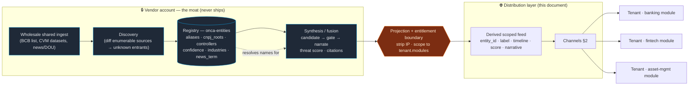

**Why the shared sensor can't be per-tenant** (ADR 002 Decision 2): you cannot
diff a list you never downloaded. Unknown-entrant discovery requires ingesting
an enumerable source *wholesale*. So the cost of discovery is paid once, shared;
distribution is where it is monetized many times. That asymmetry is the margin.

---

## 2. Channels — one product core, four ways to consume it

Every channel consumes the **same** derived scoped feed. They differ only in
*who hosts the glass* and *how the bytes are metered*. No channel gets a
different, richer dataset — that would fork the moat.

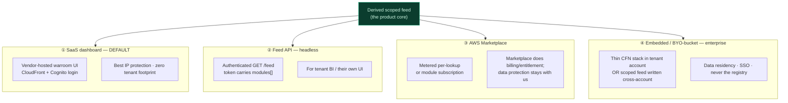

| Channel | Who hosts glass | Billing | IP exposure | ADR 002 phase |
|---|---|---|---|---|
| ① SaaS dashboard | Vendor | Module subscription | Lowest | D → E |
| ② Feed API | Tenant's own app | Subscription / metered | Low (scoped payload) | D |
| ③ Marketplace | Vendor API, AWS billing | Metered per-lookup **or** subscription | Low | E |
| ④ Tenant-hosted dashboard (**premium**) | Tenant account (thin) | Premium / enterprise | Low (glass only; no registry, no superset) | E+ |

Channel ④ is sold as a **premium tier** whose defining value is **strategic
independence**: the tenant runs their own CloudFront, so the vendor is *not*
following their team's usage. For a competitive-intelligence product that
non-surveillance is a feature worth paying for. It ships in **two options** (§3b);
reduced vendor telemetry is the sold benefit, not a defect (§8b). The
base/majority deliberately stays on vendor-hosted ① so product telemetry is
retained where most subs are.

The decision that keeps all four honest: **entitlement is server-authoritative
and enforced at the data boundary, never client-side** (ADR 002 Decision 3).
Client-side filtering is obfuscation — the superset would already be in the
browser. So every channel resolves through the same authorization gate.

---

## 3. Delivery topology — the account boundary

The tenancy rule (ADR 002 Decision 8): **anything that could reconstruct the
registry stays vendor-side; tenants receive only scoped, projected,
entitlement-gated outputs.** Channels ①–③ are pure SaaS (tenant owns nothing).
Channel ④ is the only one with a tenant-side footprint — and it is deliberately
thin: a dashboard host and/or an SSO shim that *only calls the vendor API*.

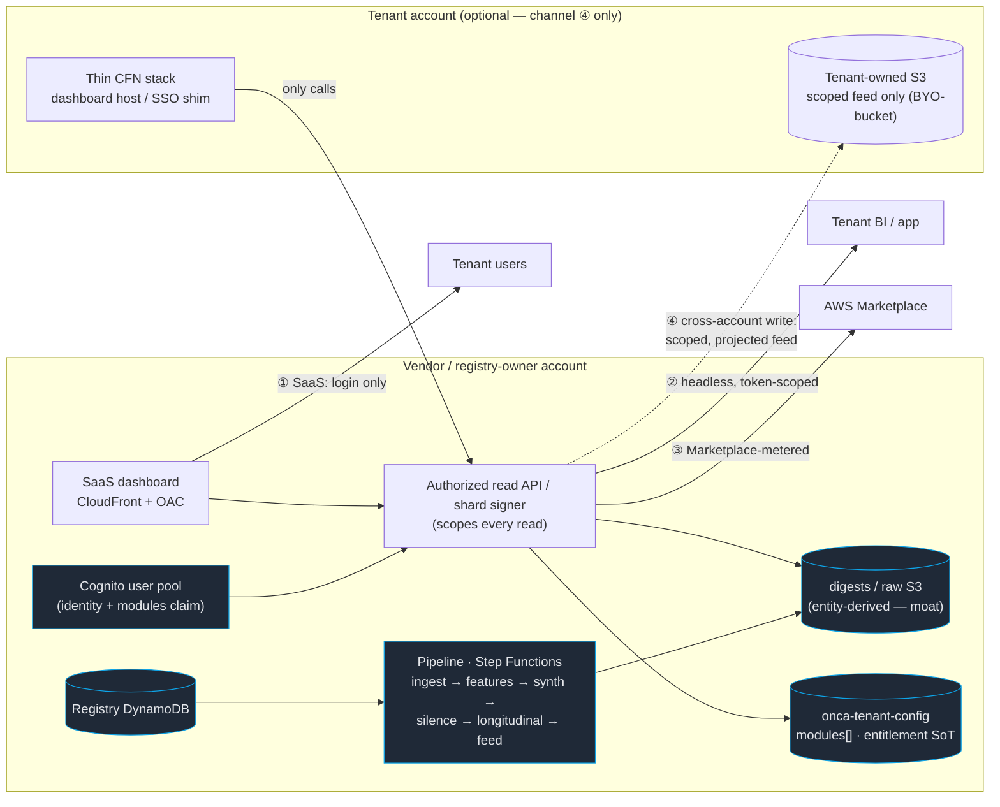

Load-bearing: the arrow from `THIN` to `API` only ever *points inward*. The
registry, pipeline, raw/digest S3, and synthesis never deploy into a tenant
account. The most a tenant hosts is glass and a login redirect.

**Precise tenant-side footprint.** In the default SaaS path (channels ①–③)
*nothing* is tenant-side — not even auth. The Cognito user pool, the token
issuer, and the entitlement source of truth (`onca-tenant-config`) are all
vendor-side; tenant users are merely pool members. A footprint appears **only in
channel ④**, as up to three *independent, optional* pieces — and the auth
**authority** is never one of them:

| Optional tenant-side piece | What it is | What it is **not** |
|---|---|---|
| Thin dashboard host | CFN stack serving the warroom glass, that only *calls* the vendor API | Not the pipeline, registry, or data |
| SSO **shim** | Federation redirect from the tenant's IdP into the vendor pool | Not the auth *authority* — Cognito + entitlement stay vendor-side |
| BYO-bucket | Tenant-owned S3 the vendor writes the **scoped, projected** feed into | Not raw/digest S3, not the superset, not the registry |

So the maximum tenant footprint is *glass + optionally an SSO shim + optionally a
scoped-feed bucket*. "Auth" as an authority is always vendor-side.

---

## 3b. Premium tier — tenant-hosted dashboard (two options)

Channel ④ is the premium, and its defining value is **strategic independence**:
the tenant runs their own CloudFront so the vendor is *not* watching their team's
usage. For a competitive-intelligence product that non-surveillance is worth
paying for — a bank does not want the vendor seeing which rivals its strategy desk
studies most. So tenant-hosting **loses in-glass vendor telemetry by design**
(§8b), and that is priced as a benefit, not a defect. The constraint that *does*
hold: entitlement enforcement stays intact and the registry/superset never ship.
**Keep the base/majority on vendor-hosted ①** so product telemetry is retained
across most subs; tenant-run CloudFront is deliberately gated behind premium
pricing precisely so it stays a minority — if it became the default, vendor-side
analytics would erode. A and B are two *depths of independence*.

### Option A — tenant glass, vendor data plane (thin premium; **default premium**)
The tenant hosts only the glass (CloudFront + static UI on their domain/branding,
optional SSO shim). **Every data read still goes to the vendor feed API**
(Pattern A). Nothing is stored tenant-side.
- **Entitlement:** at read, vendor-side — unchanged from base SaaS.
- **Analytics:** partial — the vendor still sees **server-side read patterns**
  (which modules/entities are fetched, cadence, because reads hit its API) but
  **not in-glass behavior** (clicks, drill-downs, dwell): that needs a beacon the
  tenant now hosts and, as a premium buyer, will typically strip.
- **Residency:** partial — glass/domain/SSO are theirs; data transits the vendor
  edge (projected/scoped, never the registry).

### Option B — full residency + consented beacon (data-resident premium; add-on)
The tenant hosts the glass **and** a tenant-owned S3 bucket the vendor writes the
scoped feed into cross-account (BYO-bucket). The dashboard reads its own bucket —
works offline of the vendor API; data at rest in the tenant region/account.
- **Entitlement:** at **write** — the vendor only ever writes entitled, scoped
  narratives; a module change re-writes the bucket. Still no superset/registry.
- **Analytics:** the vendor is **fully blind after the scoped write** — engagement
  data exists only via a **consented client-side beacon** to a vendor endpoint
  (governed by the DPA); disable it and the vendor sees nothing but the write.
- **Residency:** **maximal** — data at rest in the tenant account/region.

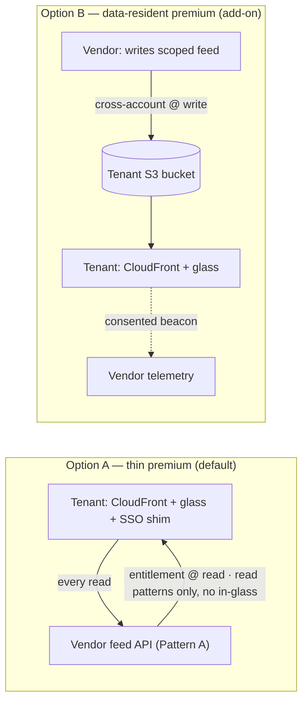

| | Entitlement | Vendor still sees | Residency | Complexity |
|---|---|---|---|---|
| **A — thin** | At read (vendor API) | Read patterns (what you pull) | Partial | Lower |
| **B — resident** | At write (scoped bucket) | Nothing (beacon-only, consented) | Maximal | Higher |

**Recommendation:** keep the **majority on base SaaS ①** (vendor CloudFront,
consented telemetry retained) — that is where product analytics live, and it must
stay the default. Sell tenant-run CloudFront as the **premium**, positioned as
independence / non-surveillance: **A** (own glass + live vendor data — no in-glass
vendor tracking, though the vendor still sees which data you pull) as the default
premium; **B** (own glass + own bucket — vendor fully blind, plus data residency)
as the enterprise top tier and the truest expression of "no vendor telemetry
follow-up." The premium is *hosting, branding, independence, and residency* —
never more data. Neither option ships the registry or the superset.

---

## 4. Entitlement enforcement — the read path end to end

This is the flow every channel funnels through. Identity gates modules (ADR 002
Decision 7: **7 gates 6** — you cannot scope what you cannot identify). Start
with **Pattern A** (authenticated feed Lambda, correctness first); migrate hot
modules to **Pattern B** (per-module static shards + CloudFront signed cookies)
when CDN economics justify it.

### Pattern A — authenticated feed API (ship first)

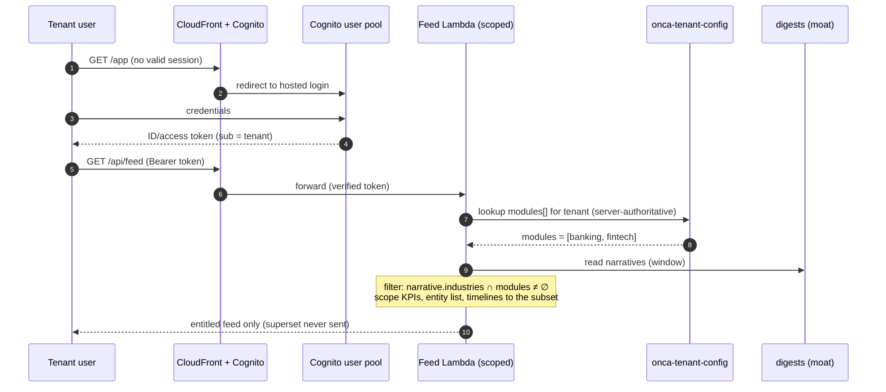

**Non-negotiables baked into step 6–8** (ADR 002 Decision 3):
- A tampered request just earns a **403** — entitlements are server-derived, the
  client never supplies its module list.
- **Scope derived data too.** KPI counts, the entity dropdown, autocomplete, and
  timelines are computed over the *entitled subset* — a count over the full set
  leaks the existence/volume of unpaid modules.
- A cross-tagged entity (e.g. a neobank = `banking` + `fintech`) shows if its
  industry set *intersects* the tenant's modules.

### Pattern B — signed shards (migrate hot modules for CDN economics)

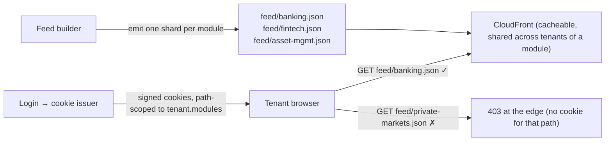

Shards are **shared across all tenants of a module** (cacheable, cheap); the
signed cookie is the per-tenant key. Same guarantee as A (no superset, edge
authorizes), recovers static-CDN caching.

---

## 5. Registry-as-asset — resolve, don't enumerate

Even inside an entitled session, the *registry* is a saleable asset, not part of
the shipped product. The only live entity endpoint is a **resolve-by-known-id**
scoped to ids the tenant already legitimately holds (ADR 002 Decision 4). No
`list` / `scan` / `batch` endpoint exists on the tenant surface.

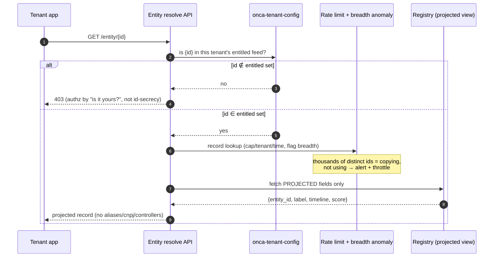

Honest ceiling (unchanged from ADR 002): copying is made *uneconomic and
detectable*, not impossible — the same bar every data vendor lives with. Layered
deterrence = entitlement authz + rate/breadth limits + license/ToS + per-tenant
**canary records** for leak forensics.

The **internal** registry CRUD API (`src/dashboard/registry_api.py`,
`/api/registry/*`) is the operator control plane and is emphatically **not** this
tenant surface — it is basic-auth'd + origin-secret'd, vendor-only, and lists /
scans freely because only operators reach it.

---

## 6. Onboarding & provisioning — signup to first scoped feed

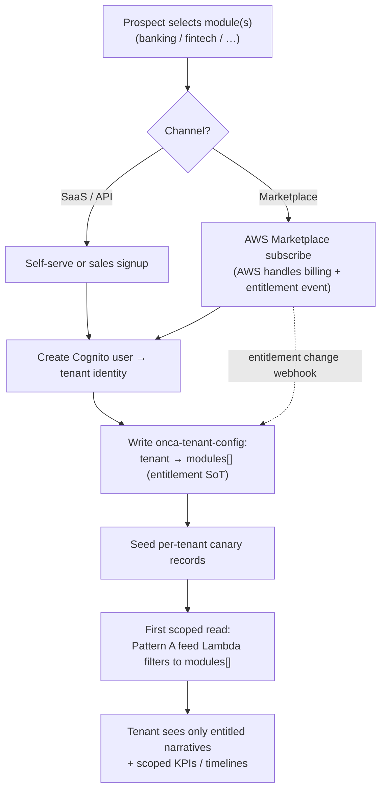

The provisioning atom is one write to `onca-tenant-config` — `tenant → modules[]`.
Everything downstream (feed scope, KPI scope, resolve-authz) derives from it, so
add/remove of a module is a single authoritative edit, never a client concern.

---

## 7. Billing lifecycle — a subscription's states

Module subscription is the primary model; Marketplace metered-per-lookup is the
alternative that maps 1:1 to the resolve endpoint. Both derive entitlement from
the same `onca-tenant-config` record.

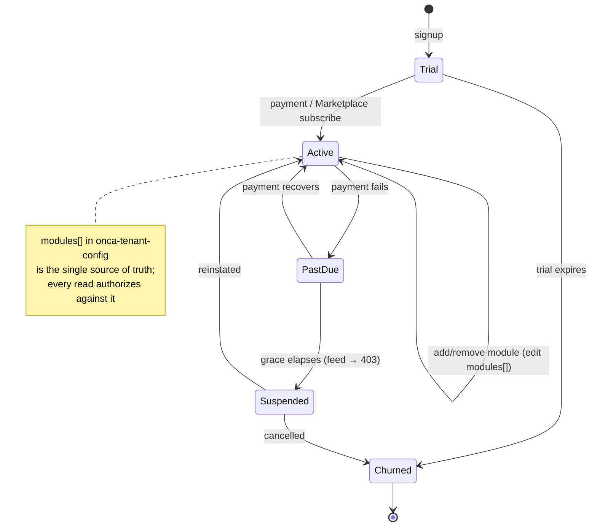

Pricing tiers filling the module catalog are **measured, not guessed** (ADR 002
Decision 5): concentration (distinct entities/industry) and richness
(narratives/industry over time) both come from the instrument the feed builder
already computes (`build_industry_volume` → `industries[]` with `covered` /
`low_volume` / `coverage_gap`). Every provisional figure ships labeled
"estimated"; no fabricated numbers.

---

## 8b. Analytics, telemetry & consent

Vendor-hosted CloudFront + the scoped feed Lambda make every read attributable to
a Cognito identity at the vendor boundary — the substrate for usage analytics,
and the *same* instrumentation ADR 002 already needs for anti-exfiltration
(breadth/volume anomaly detection). One pipe, two uses.

**Three purposes, three legal bases (LGPD applies — Brazilian FS):**
1. **Operational/security telemetry** (rate limiting, anti-scrape, metering) —
   the service functioning; contractual necessity, not a separate consent gate.
2. **Engagement analytics served back to that tenant** about its own users —
   tenant is the controller, vendor the processor (DPA); consent lives between
   the tenant and its users. This is a feature.
3. **Cross-tenant benchmarking / vendor product analytics** — requires **explicit
   tenant consent**, and must be aggregated/anonymized. Never expose one tenant's
   usage to another.

**In-glass telemetry requires the vendor to host the instrumented app; the edge
alone does not capture it.** A drill-down into an already-loaded card is a
client-side render with no network call — the vendor sees it only if the app it
*ships and hosts* beacons the event. So richness tracks *who hosts the glass*,
not who is nominally "in path":

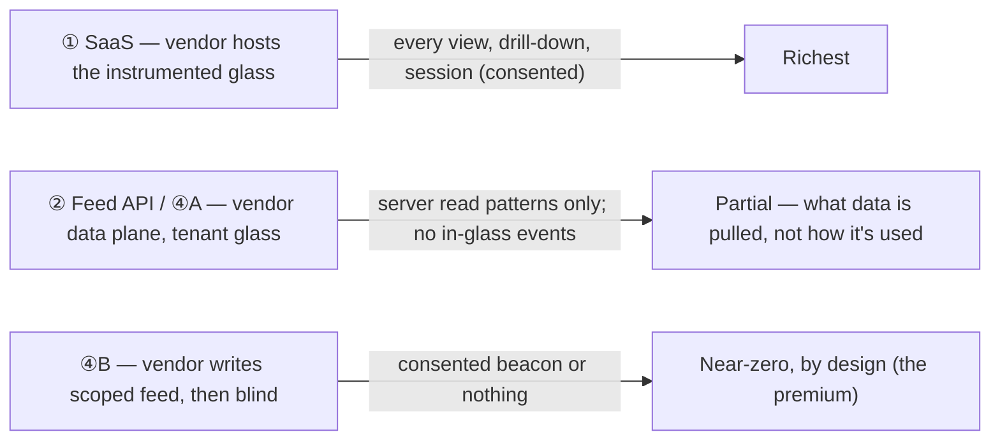

Tenant-run CloudFront (**both** ④ options) removes the vendor from the in-glass
path, so in-glass engagement telemetry is lost **by design** — that
non-surveillance is the premium's selling point, not a regression. The vendor
retains rich (consented) telemetry across the **base/majority on ①**; ④A still
leaks *server read patterns*, ④B leaves the vendor fully blind. Keeping the
majority on ① is precisely what preserves product analytics overall — so ④ must
stay premium-gated, never the default.

---

## 8. Channel readiness — what unlocks each

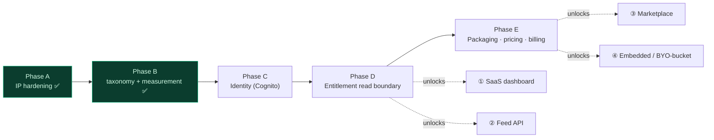

**Nothing that gates entitlements ships before Phase C** (identity). The
dashboard and internal control plane exist today under shared basic-auth — that
is the *operator* surface, not a tenant boundary. The first true tenant channel
(① SaaS) turns on when C→D lands: Cognito identity + `onca-tenant-config` +
the scoped feed Lambda.

---

## Consequences

**Positive**
- One product core, four channels — no channel forks the dataset or the moat.
- The account boundary is a single inward-pointing arrow: tenants host at most
  glass, never the registry or pipeline.
- Entitlement is one authoritative record; provisioning, billing, and resolve
  authz all derive from it.
- Marketplace and data-residency options exist without ever exposing IP.

**Costs / risks (honest)**
- The subtle leak is *derived aggregates* (KPI/timeline/autocomplete over the
  full set), not the cards — scoping must reach every computed number.
- Real tenant revenue waits on the identity layer (Phase C); today's surfaces
  are operator-only.
- Pattern A trades static-CDN caching for a Lambda read; Pattern B recovers it
  but adds a key pair + cookie issuer.
- Channel ④'s thin stack still needs a support/versioning story per tenant.

## Open decisions (owner: commercial + platform)
- **A vs B first per module:** ship A everywhere, promote only high-traffic
  modules to B? (Recommended.)
- **Marketplace billing shape:** metered-per-lookup vs module subscription as the
  *primary* Marketplace listing (both can coexist).
- **Opaque per-tenant entity handles:** hardening option beyond entitlement
  authz — worth it, or is authz-by-membership sufficient? (ADR 002 leaned: authz
  is the gate, opaque ids are optional hardening.)
