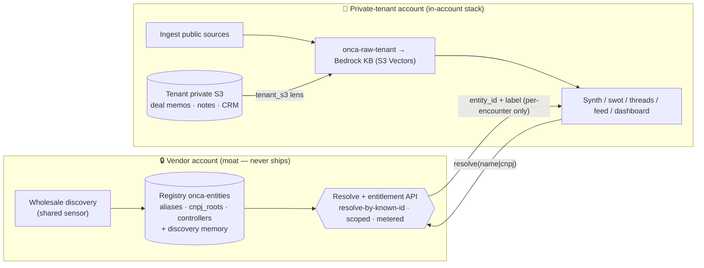

# ADR 005 — Private tenant: in-account deployment with registry-by-API and a private-data lens

- Status: **SUPERSEDED (2026-08-29)** by
  [ADR 015 — Distribution: Portal & Marketplace](2026-08-29-adr-distribution-portal-marketplace.md).
  The "Private tenant" tier is renamed and promoted to the **Marketplace** SKU;
  its mechanics (in-account stack, resolve-by-API, `tenant_s3` private lens,
  per-encounter TTL cache, metering on the resolve API) are carried forward
  unchanged. This doc is retained for the detailed deployment split and build
  deltas; ADR 015 is canonical for packaging.
- Original status: **Proposed** (2026-08-23)
- Extends [ADR 002](2026-08-18-adr-commercial-multitenancy.md) (packaging,
  entitlement, IP boundary, tenancy) and [ADR 001](2026-08-17-adr-entities-registry.md)
  (registry, resolve-not-enumerate). This ADR **revisits ADR 002's rejected
  alternative** ("deploying the pipeline into tenant accounts") and admits it —
  under one refinement that keeps the moat intact.
- Relationship to the tenancy ladder: **Private tenant** is the **top deployment
  tier**, above the premium-**module** SaaS tenants. It is a *packaging/tenancy*
  tier (where the stack runs), orthogonal to but layered above the *pricing*
  tiers ADR 002 sets by industry concentration (`banking`/`investment-banking`/
  `private-markets` = premium modules). A Private tenant may license any modules;
  what distinguishes the tier is **in-account deployment + private-data fusion**.

## Context

ADR 002 Decision 8 fixed **pure SaaS** as the default and offered two optional
tenant-side footprints — a thin dashboard stack, and bring-your-own-bucket for
residency — while **rejecting** a full in-account pipeline: *"Deploying the
pipeline/registry into tenant accounts — rejected; ships the moat. Tenant-side is
at most a thin consumption stack against the vendor API."*

That rejection is correct for the general case. But it conflates two things that
this ADR separates:

1. **The pipeline code** (ingesters, diff engine, synth/swot/threads, feed,
   dashboard) — general-purpose, no embedded IP; open-source-able.
2. **The registry data** (`onca-entities`: curated aliases, `cnpj_roots`,
   controllers, confidence, and the *discovery memory* that resolves a quietly-
   registered entrant nobody named) — **this** is the moat.

A concrete, recurring buyer breaks the SaaS default:

> A tier-1 Brazilian bank / insurer's competitive-intelligence team cannot consume
> SaaS — compliance forbids their internal research and their consumption patterns
> leaving their perimeter. They will pay a premium to run the whole stack inside
> **their own AWS account**, and they want more: their **own proprietary S3 corpus**
> (deal memos, analyst notes, CRM exports, IR trackers) fused with the public
> regulatory/competitor signal, with every claim still cited — and none of that
> private data, nor any narrative derived from it, ever leaving their account.

Two requirements are in apparent tension: *everything in the tenant account* vs.
*the registry never ships* (ADR 002 Decision 4/8). The resolution is the split the
buyer themselves proposes: **stack in-account, registry served centrally by API.**

## Decision

**Offer a `Private` deployment tier: the full Onça pipeline deploys into the
tenant's account (CDK/CFN), the entities registry stays vendor-side and is
consulted only through the ADR 002 Phase-D resolve API, and the tenant's own S3
stores are ingested as a first-class raw lens into the tenant's private KB.**

### 1. The deployment split (what runs where)

| Component | Vendor account (the moat) | Private-tenant account (in-account) |
|---|---|---|
| Entities registry (`onca-entities` DynamoDB) | ✅ owns — never leaves | ❌ never |
| Unknown-entrant **discovery** (wholesale diff → registry) | ✅ shared sensor | ❌ never re-run in-account |
| Resolve/entitlement/metering API | ✅ | ❌ (calls it) |
| Ingest of **public** sources (`src/ingest/*`) | ✅ (shared sensor) | ✅ (own copy, public data — no moat) |
| **Tenant private-S3 lens** (`tenant_s3`) | ❌ never sees it | ✅ owns exclusively |
| Synthesis / swot / threads / feed | ✅ (shared) | ✅ (own, fuses private lens) |
| `onca-raw-{tenant}` + Bedrock KB (S3 Vectors) | ✅ | ✅ (private corpus vectorized here) |
| `narratives/` · `swot/` · `feed.json` · dashboard | ✅ | ✅ (private citations resolve to internal S3 URIs) |

The membrane from the distribution model still holds — it just runs **inward**.
In SaaS, derived scoped feed crosses **out** to the tenant. Here, only
**name→entity resolution results** cross **in**. The registry stays a hard,
non-enumerable membrane in both directions.



### 2. Registry served by API — the moat stays central

The in-account synth cannot hold `onca-entities`; that **is** the IP. Resolution
in `src/synth/entities.py` instead calls the vendor endpoint (extend
`src/dashboard/registry_api.py`), reusing ADR 002 Phase-D's approved contract —
**resolve-by-known-id / -known-name, projected, rate-limited, no list/scan/batch:**

```
POST /resolve  { name? , cnpj_root? , ispb? , ticker? }
  → { entity_id, display_name, canonical_id, industries[], confidence }
```

It returns **only what is needed to cluster the signal at hand** — never the alias
set, the `cnpj_roots` list, the controllers graph, or the discovery memory. So the
moat never materializes in-account, exactly the resolve-not-enumerate rule ADR 001/002
already enforce.

- **Discovery stays central.** The in-account pipeline does **not** re-run
  wholesale diff to build its own registry — that would ship the moat's mechanism.
  Newly discovered entity_ids relevant to the tenant's modules are delivered *by
  the same API* (a scoped discovery feed), so the tenant benefits from the shared
  sensor without ever holding it.
- **Offline resilience:** cache **only entities this tenant has actually
  encountered**, TTL'd and entitlement-scoped — never a bulk pull (a bulk pull
  *is* the leak). The cache is per-encounter, non-enumerable, and disposable.
- **Leak controls (inherited):** per-tenant rate limits, breadth-anomaly
  detection, and canary records for forensics (ADR 002 Phase D).

### 3. Tenant private S3 as a raw lens → private KB

A new ingester `src/ingest/tenant_s3.py` treats configured tenant buckets/prefixes
like any other source: enumerate objects, diff via the same `src/diff/engine.py`
seen-set, normalize to raw docs in the tenant's `onca-raw-{tenant}`, which Stage-A
KB ingestion vectorizes into the **tenant's** KB. Synthesis then fuses public
regulatory/competitor signal **with** the tenant's own documents. `citations.py`
is unchanged, so every fused claim still carries a source URL — private citations
resolving to internal S3 URIs that never leave the account.

*That* is the premium: narratives no competitor can reproduce, because half the
corpus is the customer's own — delivered under full data residency.

### 4. Entitlement & billing ride the one central thing

Because every in-account run must call `/resolve`, the resolve API is the natural
**metering + entitlement chokepoint**: scope to the tenant's licensed modules,
meter usage, and revoke — all vendor-side, on the one component that stayed
central. No client-side enforcement (ADR 002's rejected obfuscation) is involved.

### 5. Migration / bridge path

Honors CLAUDE.md's "SaaS first, in-account later, bridge migration": a tenant
graduates SaaS → Private by deploying the CDK stack in their account and flipping
`src/synth/entities.py` resolution from the internal registry to the `/resolve`
endpoint — an **identical contract** either way. No re-modeling; the boundary that
was a network hop in SaaS becomes a cross-account API call.

## Consequences

**Positive**
- Resolves the regulated-buyer objection SaaS cannot: data residency + fusion with
  proprietary data + private citations — the three things a compliance-bound CI
  team cannot get from a shared tenant.
- The moat (registry + discovery memory + curation) never ships; the vendor still
  bills, because entitlement rides the central resolve API.
- Per-tenant Bedrock/KB compute lands on **their** account — off the vendor's
  ~$100/mo prototype ceiling. S3 Vectors (not OpenSearch) keeps the tenant's idle
  floor low too — the cost discipline travels with the stack.
- A clean top of the tenancy ladder above premium-module SaaS tenants.

**Costs / risks (honest)**
- The resolve API becomes a **hard runtime dependency** for an in-account deploy.
  The encounter-only TTL cache mitigates outages but is itself a partial-leak
  surface — cap it, TTL it, keep it non-enumerable.
- **Support into a black box:** by design the vendor cannot see tenant data or
  narratives. Ship strong in-account self-diagnostics; support is harder.
- **Private-lens governance:** the tenant corpus can be noisy/unstructured. Keep
  the strategic-weight + emit-on-change discipline so internal docs don't drown
  official filings; keep the "estimated"-label rule for any derived score.
- **Deployment surface:** shipping the pipeline as tenant-deployable CFN widens
  the release/compat surface (per-tenant version skew). Pin a supported stack
  version; the resolve contract is the compatibility boundary.
- Higher-touch onboarding and a per-tenant AWS footprint to certify.

## Alternatives considered
- **Pure SaaS only (ADR 002 default)** — rejected *for this buyer*; residency +
  private-data fusion are unmet. SaaS remains the default for everyone else.
- **In-account pipeline *and* registry (ADR 002's rejected form)** — still
  rejected; ships the moat. This ADR ships only the pipeline.
- **Re-running wholesale discovery in-account** — rejected; ships the discovery
  mechanism. Discovery stays central, delivered via the scoped API.
- **Bulk registry replica in-account (even read-only)** — rejected; a replica *is*
  the moat. Only per-encounter, TTL'd, non-enumerable resolution results land.
- **Bring-your-own-bucket (ADR 002)** — insufficient alone: it delivers a scoped
  feed for residency but runs no in-account synthesis and cannot fuse the tenant's
  private corpus.

## Build deltas (against the current repo)
- `src/ingest/tenant_s3.py` — private-S3 lens (enumerate + diff + normalize),
  wired into the in-account ingest budget like any other source.
- `src/synth/entities.py` — resolution mode switch: internal registry (SaaS) vs.
  `/resolve` API (Private); encounter-only TTL cache; scoped discovery-feed intake.
- `src/dashboard/registry_api.py` — harden `/resolve` for cross-account callers:
  per-tenant auth, rate limit, breadth anomaly, canary records, metering hook.
- CDK: a **tenant-deployable** stack variant (pipeline + KB + dashboard, **no**
  registry/discovery), parameterized by tenant bucket list + vendor API endpoint +
  credentials.
- Docs: fold the Private tier into the distribution model's channel/billing flows.

*Phasing:* this rides **after** ADR 002 Phase C (identity) and Phase D (resolve
boundary) — the `/resolve` API and entitlement source of truth must exist before a
Private tenant can consume them. It is a Phase-E packaging option, not a
prerequisite.
