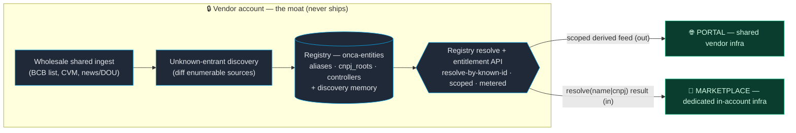
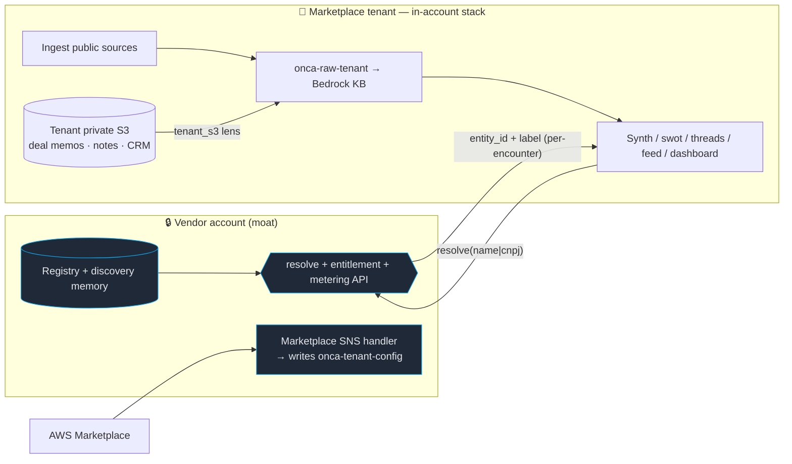

# ADR 015 — Distribution: two SKUs, Portal and Marketplace (telemetry is the axis)

- Status: **Proposed (2026-08-29), REVISED by
  [ADR 016 — Distribution tiers](2026-08-30-adr-distribution-three-tier.md) (2026-08-30).**
  ADR 016 keeps this ADR's telemetry axis + moat invariant but adds a delivery/sovereignty
  axis: *Portal* splits into **Entry Portal** (static, CloudFront multi-tenant) + **SaaS
  Platform** (dynamic API), and *Marketplace* becomes **Sovereign**. Read ADR 016 for the
  current tiering; the principles below still hold.
- **Consolidates and supersedes** two documents:
  - [distribution-model (2026-08-19)](2026-08-19-distribution-model.md) — the
    4-channel / orthogonal-rail taxonomy. **Superseded by this ADR.**
  - [ADR 005 — Private tenant (2026-08-23)](2026-08-23-adr-private-tenant-in-account.md)
    — in-account deployment + registry-by-API. **Superseded by this ADR**, whose
    mechanics become the **Marketplace** SKU.
- **Builds on (does not replace)** [ADR 002 (2026-08-18)](2026-08-18-adr-commercial-multitenancy.md)
  (packaging, entitlement, IP/moat boundary, tenancy) and
  [ADR 001](2026-08-17-adr-entities-registry.md) (registry, resolve-not-enumerate).
  ADR 002 remains the **principles substrate**; this ADR fixes the **product
  packaging** those principles ship as.

## Why consolidate

The distribution-model doc modelled delivery as a **2×2** — *who hosts the glass*
(vendor vs tenant) × *how it's billed* (direct vs AWS Marketplace) — plus a
telemetry **spectrum** (rich on vendor glass, partial on thin-glass, near-zero on
BYO-bucket) and a separate top tier (ADR 005 Private). In practice that produced
four channels, an orthogonal rail, two premium sub-options, and a fifth tier — more
surface than the business actually sells.

We collapse it to **two distributions** by making **telemetry the single defining
axis** and coupling the axes the old model kept orthogonal:

> **Portal** — shared infrastructure, telemetry **on** (consented), billed direct.
> **Marketplace** — dedicated (in-account) infrastructure, telemetry **off**,
> billed through AWS Marketplace, consumes the central **Registry (resolve) API**.

Telemetry is now **binary**: you are either on shared infra and consent to
telemetry (Portal), or you pay — on your own AWS bill — to run your own stack and
be unobserved (Marketplace). The reduced-telemetry middle grounds (thin-glass on
the vendor data plane, BYO-bucket residency add-on) are **retired** (§What we
dropped).

## The one invariant, unchanged (ADR 002 Decision 4/8)

Both SKUs sit behind the same hard membrane. **Ingest broadly once (shared
sensor); persist finds once (the registry — the moat); the registry never ships.**
Only derived, IP-stripped, entitlement-scoped output crosses to a customer — and
in Marketplace's case, only **name→entity resolution results** cross *inward*.



## The two distributions

| | **Portal** | **Marketplace** |
|---|---|---|
| **Who it's for** | Subscribers who **opt not** to run dedicated infrastructure | Industries/enterprises that **opt out of telemetry** and buy via AWS Marketplace |
| **Infrastructure** | Shared, **vendor-hosted** (SaaS) | **Dedicated** — full pipeline deployed **in the tenant's AWS account** |
| **Telemetry** | **On** — consented; the deal for shared infra | **Off** — non-observation is the paid-for value |
| **Billing rail** | Direct (vendor MSA / signup / invoice) | **AWS Marketplace** — draws down the customer's AWS committed-spend/EDP |
| **Registry access** | Not needed — vendor pipeline resolves internally; tenant gets the derived feed | **Required** — in-account synth calls the central **resolve API** (no local registry) |
| **Private-data fusion** | No — public signal only | **Yes** — tenant's own S3 corpus fused into a private KB, private citations stay in-account |
| **Data direction across the membrane** | Derived scoped feed crosses **out** | Only resolution results cross **in** |
| **IP exposure** | Low — registry/superset never ship | Low — registry/discovery never ship; only resolve results land |
| **ADR 002 phase** | D → E | E (rides after C/D: identity + resolve boundary) |

Both derive entitlement from the **same** server-authoritative record
(`onca-tenant-config`, `tenant → modules[]`) and honour the same
resolve-not-enumerate contract (ADR 002 Decisions 3/4). The SKU changes **where
the stack runs and whether the vendor observes usage** — never the moat rules.

## Portal — shared infra, telemetry-on

The default, and where the majority of subscribers live. It absorbs the old
vendor-hosted channels (SaaS dashboard **and** the optional headless Feed API —
now two *delivery formats* of one SKU, not separate channels).

- **Hosting:** vendor account only. CloudFront + Cognito login; the tenant owns
  nothing. Best IP protection, lowest onboarding touch.
- **Delivery formats (both Portal):** (a) the vendor-hosted warroom dashboard;
  (b) an authenticated `GET /api/feed` for the tenant's own BI/app (token carries
  `modules[]`). Same scoped data, same enforcement.
- **Entitlement (ADR 002 Decision 3):** server-authoritative and enforced at the
  data boundary. Ship **Pattern A** (authenticated feed Lambda filters to
  `modules[]`; superset never sent; **derived aggregates — KPI counts, entity
  dropdown, autocomplete, timelines — scoped too**); migrate hot modules to
  **Pattern B** (per-module static shards + CloudFront signed cookies) when CDN
  economics justify it.
- **Telemetry (the deal):** because the vendor hosts the instrumented glass, every
  view/drill-down/session is attributable at the vendor boundary — the substrate
  for product analytics **and** the anti-exfiltration instrument (breadth/volume
  anomaly detection). Portal subscribers **consent** to this; it is stated at
  onboarding and governed under LGPD (operational/security = contractual
  necessity; per-tenant engagement analytics = processor/DPA; cross-tenant
  benchmarking = explicit consent, aggregated/anonymized only).
- **Billing:** direct. Module subscription is primary; states =
  Trial→Active→PastDue→Suspended(feed→403)→Churned, all deriving from the one
  `onca-tenant-config` record.

## Marketplace — dedicated in-account infra, telemetry-off, Registry-by-API

This is ADR 005's Private tenant, promoted to the second canonical SKU and sold on
the AWS Marketplace rail. Its defining value is **non-observation + residency +
private-corpus fusion** — the three things a compliance-bound CI team cannot get
from shared infra.

- **Hosting:** the full Onça **pipeline** (ingest, diff, synth/swot/threads, feed,
  dashboard) deploys into the **tenant's** AWS account via CDK/CFN. Per-tenant
  Bedrock/KB compute lands on **their** bill — off the vendor's prototype ceiling.
- **Telemetry: off by design.** The vendor is not in the glass and does not host
  the data plane, so team usage is unobserved. That non-surveillance is the
  product, not a regression — which is exactly why it is gated behind the paid,
  dedicated tier and **why the majority must stay on Portal** (that is where
  product analytics live).
- **Registry access — required, central-only.** The in-account synth **cannot**
  hold `onca-entities` (that *is* the moat). Resolution in `src/synth/entities.py`
  calls the vendor **resolve API** (ADR 001/002 Phase-D contract), reusing
  resolve-by-known-id/-known-name, projected, rate-limited, no list/scan/batch:

  ```
  POST /resolve  { name? , cnpj_root? , ispb? , ticker? }
    → { entity_id, display_name, canonical_id, industries[], confidence }
  ```

  It returns only enough to cluster the signal at hand — never the alias set,
  `cnpj_roots`, the controllers graph, or the discovery memory. **Discovery stays
  central** (never re-run in-account); newly discovered ids relevant to the
  tenant's modules arrive via the same scoped API. Offline resilience = a
  **per-encounter, TTL'd, entitlement-scoped, non-enumerable** cache — never a
  bulk pull (a bulk pull *is* the leak).
- **Private-data fusion:** `src/ingest/tenant_s3.py` treats configured tenant
  buckets/prefixes as a first-class raw lens → the tenant's `onca-raw-{tenant}` →
  the **tenant's** Bedrock KB. Synthesis fuses public regulatory/competitor signal
  **with** the tenant's own documents; `citations.py` is unchanged, so private
  citations resolve to internal S3 URIs that **never leave the account**.
- **Billing + entitlement handshake (AWS Marketplace rail):** customer subscribes
  on Marketplace → Marketplace fires SNS (`subscribe`/`entitlement-updated`) → a
  vendor handler translates it into a write to `onca-tenant-config`. Spend lands on
  the customer's consolidated AWS bill (AWS takes its cut; **Private Offers** for
  negotiated terms). **Marketplace does billing + the entitlement handshake, not
  the data boundary** — "data protection stays with the seller" (ADR 002 §4).
  Because every in-account run must call `/resolve`, that endpoint is the natural
  **metering + entitlement + revoke chokepoint** — the one component that stayed
  central.



## Telemetry as the defining axis (why binary is honest)

In-glass engagement telemetry (clicks, drill-downs, dwell) is only captured when
the **vendor hosts the instrumented app** — the edge alone does not see a
render-only drill-down. The old model tried to sell three points on that spectrum;
in reality the customer either accepts vendor-hosted glass (full telemetry, shared
infra, cheaper → **Portal**) or rejects observation entirely and runs their own
stack (**Marketplace**). There is no durable middle: a thin glass on the vendor
data plane still leaks *read patterns*, which the exact buyer who wants
non-observation will not accept — so it collapses into Marketplace anyway. Making
telemetry binary removes a false choice and sharpens the pitch of each SKU.

## What we dropped (from the superseded docs)

| Retired concept | Where it lived | Why it's gone |
|---|---|---|
| Marketplace as an **orthogonal billing rail** wrapping any hosting | dist-model §2b (the 2×2) | Rail is now **coupled** to dedicated infra; "Marketplace" names the SKU, and Portal is always direct-billed. |
| **Thin-glass premium ④A** (tenant glass, vendor data plane, reduced telemetry) | dist-model §3b Option A | The reduced-telemetry middle; leaks read patterns, so the non-observation buyer goes full dedicated. Collapsed into Marketplace. |
| **BYO-bucket residency add-on ④B** | dist-model §3b Option B | Residency is now delivered by full in-account deployment (Marketplace), which also fuses private data — strictly more than a scoped-feed bucket. |
| **Telemetry spectrum** (rich / partial / near-zero) | dist-model §8b | Replaced by the binary Portal-on / Marketplace-off axis. |
| **"Private tenant" as a separate 5th tier** | ADR 005 | Renamed and promoted to the **Marketplace** SKU; its mechanics (in-account stack, resolve-by-API, tenant_s3 lens) are preserved verbatim here. |

## Consequences

**Positive**
- Two SKUs a customer can self-select on one question — *do you accept telemetry
  on shared infra, or pay to run your own unobserved?* — instead of a 2×2 + spectrum.
- One product core, one moat, one entitlement record; the membrane rules are
  identical across both SKUs (out for Portal, in for Marketplace).
- Marketplace's AWS-bill procurement (EDP draw-down, Private Offers) is the decisive
  enterprise pull, and it lands per-tenant compute off the vendor's cost ceiling.
- The registry/discovery moat never ships in either SKU.

**Costs / risks (honest)**
- Dropping the middle tier removes a "residency without in-account ops" option; a
  residency-but-not-full-stack buyer must now take the heavier Marketplace deploy.
  (Judged acceptable: that buyer is rare and the thin option leaked read patterns.)
- Portal's derived-aggregate scoping (KPI/timeline/autocomplete over the full set)
  is still the subtle leak — every computed number must be scoped.
- Marketplace makes the resolve API a **hard runtime dependency** for in-account
  deploys; the per-encounter TTL cache mitigates outages but is a partial-leak
  surface — cap/TTL/keep non-enumerable.
- **Support into a black box:** by design the vendor cannot see Marketplace tenant
  data/narratives; ship strong in-account self-diagnostics.
- Real revenue on either SKU waits on ADR 002 Phase C (identity) then D (resolve +
  entitlement boundary); Marketplace additionally needs the tenant-deployable CDK
  variant and the Marketplace SNS→config handler.

## Build deltas (net, after consolidation)

Portal needs nothing beyond ADR 002 Phase C/D (identity + Pattern-A feed API +
`onca-tenant-config`). Marketplace carries ADR 005's deltas forward unchanged:
- `src/ingest/tenant_s3.py` — private-S3 lens (enumerate + diff + normalize).
- `src/synth/entities.py` — resolution mode switch (internal registry for Portal
  vendor pipeline vs `/resolve` API in-account); encounter-only TTL cache; scoped
  discovery-feed intake.
- `src/dashboard/registry_api.py` — harden `/resolve` for cross-account callers:
  per-tenant auth, rate limit, breadth anomaly, canary records, metering hook.
- CDK: a **tenant-deployable** stack variant (pipeline + KB + dashboard, **no**
  registry/discovery), parameterized by tenant bucket list + vendor API endpoint +
  credentials.
- Marketplace integration: SNS `subscribe`/`entitlement-updated` handler →
  `onca-tenant-config`; metering reports reconciled from Marketplace.

## Open decisions (owner: commercial + platform)
- **Portal delivery default:** dashboard-first with Feed API as an add-on, or offer
  both at parity from day one? (Lean: dashboard-first.)
- **Marketplace listing shape:** metered-per-resolve vs module subscription with a
  fair-use resolve cap as the primary listing (both can coexist).
- **Portal-on-Marketplace-rail:** we deliberately coupled the rail to the dedicated
  SKU. If a customer wants shared infra billed on their AWS bill, do we allow the
  AWS Marketplace rail to bill a Portal sub as an exception, or hold the line that
  Marketplace ⇒ dedicated? (Lean: hold the line; revisit if enterprise demand.)
