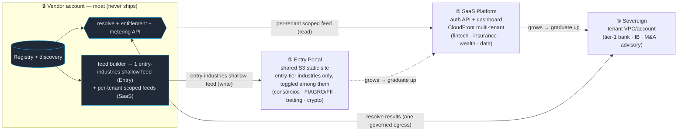

# ADR 016 — Distribution tiers: Entry Portal · SaaS Platform · Sovereign (delivery × vertical)

- Status: **Proposed** (2026-08-30).
- **Revises** [ADR 015 — Portal & Marketplace](2026-08-29-adr-distribution-portal-marketplace.md).
  ADR 015's **telemetry axis and moat invariant stand**; this ADR adds a second,
  orthogonal **delivery-mechanism / sovereignty axis** and keys the default tier to the
  **vertical**. ADR 015's *Portal* splits into **Entry Portal** (static) + **SaaS
  Platform** (dynamic); its *Marketplace* becomes **Sovereign**.
- **Builds on** [ADR 002](2026-08-18-adr-commercial-multitenancy.md) (packaging,
  entitlement, IP/moat, price-by-concentration) and [ADR 001](2026-08-17-adr-entities-registry.md)
  (registry, resolve-not-enumerate). ADR 002 remains the principles substrate.

## Why revise

ADR 015 was right that **telemetry is a defining axis**, but as **data and tenant count
grow** one shared "Portal" is too coarse. Two things vary by *vertical*, and they track
ADR 002's "price by concentration × regulation":

- **Delivery mechanism** — a fragmented, high-tenant-count, low-ARPU vertical (consórcios,
  FIAGRO/FIIs) wants a **cheap static feed at scale**; an interactive mid vertical (fintech,
  insurance) wants a **dynamic API + dashboard**; a concentrated, highly-regulated buyer
  (tier-1 banking, M&A) wants the stack **inside its own perimeter**.
- **Sovereignty** — how close to the customer's control plane the compute runs.

So we productize **three delivery tiers**, each a point on ADR 015's telemetry axis, with a
**default vertical mapping** and an **upward migration ladder** (a tenant graduates as it
grows). The moat invariant is untouched.

## The moat invariant (unchanged, ADR 002 Decision 4/8)

Ingest broadly once (shared sensor) → persist finds once (the registry, the moat) → the
**registry never ships**. Only derived, IP-stripped, entitlement-scoped output crosses out;
for Sovereign, only **name→entity resolution results** cross *inward* over one governed
egress (see §Sovereign).

## The three tiers

| | **Entry Portal** | **SaaS Platform** | **Sovereign** |
|---|---|---|---|
| **Delivery** | Static S3 feeds — **one shared static site** (the entry-tier industries only, toggled among them) | Authenticated **dynamic API** + dashboard, **CloudFront multi-tenant** (per-tenant scoped) | Stack in the tenant's **own VPC / account** |
| **= ADR 015** | Portal (static half, Pattern B) | Portal (dynamic half, Pattern A) | Marketplace (extended) |
| **Telemetry** | On — *read patterns only* (static ⇒ no in-glass) | On — *richest* (vendor-hosted glass) | **Off** |
| **Entitlement enforced** | at **write** (feed scoped to the entry-tier industries + shallow depth; higher-tier industries and deeper signals are never in it — the on/off toggle only filters *among* the entry industries, it's not a paywall) | at **read + per-tenant** (server-authoritative feed Lambda; multi-tenant distribution scopes each tenant to its modules) | at **resolve** (the central API meters it) |
| **Hosting** | Vendor | Vendor | Tenant VPC/account |
| **Billing** | Low / self-serve / metered | Module subscription (direct) | AWS Marketplace + Private Offers; compute on the tenant's bill |
| **Default verticals** | Consórcios · FIAGRO/FIIs · Betting/Gaming · Crypto | Fintech/Adquirência · Insurance (SUSEP) · Wealth/Asset Mgmt · Data/Analytics | Tier-1 Banking · Investment Banking · M&A/Private Markets · Advisory |

Telemetry is still **on (Entry + SaaS) vs off (Sovereign)** — Entry isn't a *sold*
reduced-telemetry tier (the middle ADR 015 retired); it simply *captures less by mechanism*
because a static feed has no vendor-hosted glass to instrument. Both Entry and SaaS are
shared-vendor-infra, telemetry-on, consented.

## Tierization rationale (sensitivity → signal depth → persona)

The tier a vertical lands in is driven by **data sensitivity**, which in turn sets the
**depth of signal/inference** it's worth delivering and the **buyer persona** it serves:

| Vertical group | Data sensitivity | Regulatory / signal depth tracked | Tier | Primary buyer |
|---|---|---|---|---|
| Consórcios · Betting · FIAGRO/FIIs · Crypto | Low–Medium (public / niche) | Centralized BCB circulars, SPA/MF authorizations, CVM public filings | **Entry Portal** (static S3) | Operational heads, niche strategists, product managers |
| Fintech · Adquirência · Insurance · Wealth | Medium–High (competitive) | PIX operational moves, SUSEP circulars, B3 trading signals | **SaaS Platform** (dynamic API) | VPs of Strategy, Compliance Officers, Risk Directors |
| Banking · Investment Banking · Private Markets | Prime / Sovereign | Systemic risk, institutional sanctions, C-suite M&A, cross-entity graph | **Sovereign** (tenant VPC) | CEOs, Board members, Enterprise CROs |

**The "signal depth" column is a projection filter (by lens/axis), not a second pipeline —
and it is what separates the tiers, NOT the industry set.** The one pipeline ingests everything
(the moat tracks all signals/entities); the tier feed is scoped by **depth**, mapping to the
corpus's existing lens/axis layers:
- **Entry** — the shallow public-filing lenses (regulatory/dou/fatos, funds), **scoped to the
  entry-tier industries only** (consórcios, FIAGRO/FIIs, betting, crypto). Higher-tier industries
  (fintech/insurance/wealth/banking/IB/…) are **not fed or displayed** here. The buyer **toggles
  those entry industries on/off client-side** — a convenience over one shared feed among the
  entry set, not a paywall (nothing outside the entry-tier industries or the shallow depth is in
  the Entry feed to leak).
- **SaaS** — operational + competitive depth (pix/juros/market/ofertas + news), **scoped per
  tenant to its licensed modules** (this is where per-industry entitlement lives, enforced at read
  + by the multi-tenant distribution).
- **Sovereign** — the full derived graph/inference layer (relational/predictive/ecosystem/cohort
  — cross-entity graph, systemic-risk inference, M&A).

So the **deepest, highest-value derived intelligence is Sovereign-only**, SaaS gets the
competitive/operational middle scoped per tenant, and Entry gets broad-but-shallow with
client-side toggles — the right moat/pricing logic (premium depth for the premium, C-suite
buyer). All of it is a *filter at the projection boundary* (by lens/axis; per-tenant module
scoping on SaaS), never a fork of ingest or synth.

## ① Entry Portal — one shared static site, entry-tier industries, client-toggled

For fragmented, high-count, low-ARPU verticals where per-tenant cost must approach zero.

- **Mechanism**: **one shared static feed** scoped to the **entry-tier industries only**
  (consórcios, FIAGRO/FIIs, betting, crypto) at shallow public-filing depth, on S3 + a regular
  CloudFront distribution, and **one shared static dashboard**. Every entry subscriber sees the
  same entry feed and **toggles those entry industries on/off client-side** — a UX convenience
  among the entry set, not entitlement: the higher-tier industries and the deeper signals are
  never in the feed to leak (both the industry scope and the depth are enforced at feed-build,
  §Tierization). This is deliberately **not** the per-tenant multi-tenant machinery — that lives
  on SaaS, where entitlement differs per tenant. Entry's simplicity (one feed, one site,
  self-serve) is the tier's whole point.
- **Telemetry**: server/edge **read patterns** only (CloudFront access logs) — no in-glass
  beacon. Enough for anti-scrape (breadth/volume anomaly) + basic usage.
- **Cost**: one static feed + one static site, CDN-cached, no per-request Lambda, near-zero
  idle floor. Adding a subscriber costs nothing — they hit the same shared site; scale is a
  CDN concern, not a per-tenant one.

**Derived projection, not a parallel pipeline — "don't fork the pipeline; fork the feed."**
The Entry Portal is a *filtered slice of the one full feed*, never a second sensor. The
**single** pipeline (ingest → synth → detectors → feed builder) runs once over **all** entities
— that is the moat and the full-coverage source of truth, kept **unchanged**. The feed builder
then emits one additional **entry-scoped feed**: filter on **two** dimensions using the
`industries[]` + lens/axis each card already carries — **industry** (keep only the entry-tier
modules: `consórcio`, `agri-funds`/`real-estate-funds`, `betting`, `crypto`) **and depth** (keep
only the shallow public-filing lenses, drop the deeper SaaS/Sovereign layers) — and write it as
**one shared static feed** (not per-tenant shards). Three consequences fall out for free:
**(a)** the original keeps tracking every entity across every industry at full depth, untouched;
**(b)** the entry feed can never contain a higher-tier industry *or* a deeper signal — a strict
projection, so the premium tiers never leak and there is no drift to keep in sync; **(c)** zero
extra ingest/synth cost — just one more scoped write. The Entry **dashboard** is derived the same
way: a **thin static glass** reading that one shared feed (no API, no per-request Lambda), with
the on/off toggles among the entry industries done **client-side**, reusing the frontend
components with the dynamic bits (agent Q&A, live filters) stripped — those stay on SaaS. A second parallel ingest+synth pipeline is explicitly
rejected: it would fork the moat, duplicate Bedrock/ingest cost, and drift from the original.

**Entry dashboard = a separate thin artifact, not a runtime "context" toggle — fork the
glass, not the design system.** The Entry dashboard is its **own** buildless static
`index.html` (e.g. `site/entry/`), served from a **regular** CloudFront static distribution
(Entry is one shared site, not multi-tenant) — *not* the SaaS `index.html` conditionally
hiding panels. A context-toggle
inside the SaaS bundle would ship all the dynamic JS (agent Q&A, live filters, the
coverage/monitor drawer) to the cheapest tier and couple the two evolutions, defeating
Entry's thin/static/cheap purpose. Keep it DRY without forking the look: factor the shared
presentation primitives — the **palette/theme tokens** and the **card/feed render helpers** —
into plain static includes (`site/shared/theme.css`, `site/shared/render.js`) that BOTH
dashboards `<link>`/`<script src>` (no bundler — matches the buildless constraint). The SaaS
shell = shared + dynamic panels; the Entry shell = shared only. The Entry feed is the same
JSON schema (just scoped to the entry-tier industries + shallow depth), so the shared render
helpers work unchanged — the Entry shell renders that feed and exposes on/off toggles **among
the entry industries**. **Entry is ONE shared artifact + ONE shared feed** for all entry
subscribers; the per-tenant multi-tenant machinery (a distribution template pointing each
tenant at its own scoped feed) is a **SaaS** concern, not Entry's — see §②.

## ② SaaS Platform — dynamic API + dashboard

The default for interactive mid verticals (the richest product surface).

- **Mechanism**: authenticated `GET /api/feed` (Pattern A feed Lambda) + the vendor-hosted
  warroom dashboard + agent Q&A. Entitlement enforced **at read**, server-authoritative
  (`requested ∈ tenant.modules`); derived aggregates (KPIs, autocomplete, timelines) scoped
  too. **This is where CloudFront multi-tenant lives**: a distribution *template* → per-tenant
  distributions (custom domain + config), each scoped to that tenant's licensed modules — the
  per-tenant scoping Entry deliberately doesn't need. Hot modules can also be served as signed
  static shards through the same multi-tenant distributions for CDN economics.
- **Telemetry**: richest — vendor hosts the instrumented glass (every view/drill-down/session,
  consented; the same instrument as anti-exfiltration).
- **Billing**: module subscription, direct.

## ③ Sovereign — stack in the tenant's perimeter

The premium for concentrated, compliance-bound buyers (ex-ADR 015 Marketplace + ADR 005
Private tenant): the full pipeline runs in the **tenant's own VPC/account** (CDK/CFN), with
**tenant private-data fusion** (their S3 corpus → their KB, private citations never leave),
telemetry **off** (non-observation is the product).

- **Entity resolution — keep the live resolve API (decided).** The in-account synth calls the
  central `POST /resolve` (resolve-by-known-id, projected, rate-limited, no list/scan/batch)
  over **one governed, audited egress**. The registry/discovery **stay central** and never
  ship; only per-encounter resolution results cross in. That endpoint is the metering +
  entitlement + revoke chokepoint.
- **Honesty on "air-gapped":** with a live resolve API, Sovereign is a **sovereign private-VPC
  with a single audited egress**, *not* a zero-egress air-gap. That is the deliberate trade:
  it keeps the moat central (no registry replica) at the cost of one outbound dependency. A
  **true zero-egress** variant (a bounded, entitlement-scoped resolution *snapshot* synced in
  on a cadence) is **deferred** — it trades staler discovery and a larger moat-exposure surface
  for full air-gap, and no buyer has yet required it. Revisit if one does.

## Migration ladder (default by vertical, graduate up)

The `tier` is a **default the vertical lands in**, not a cage: a tenant **graduates up** as
its data footprint, tenant count, or compliance needs grow (Entry → SaaS → Sovereign; a
tier-1 bank starts at Sovereign). Migration re-provisions **delivery only** — the
**entitlement source of truth is unchanged** (`onca-tenant-config` gains a `tier` field
alongside `modules[]`), and the moat/registry boundary is identical in every tier. So
"migrating tiers" is a delivery-plane change, never a re-model. Downward migration is possible
but not a product goal.

## Consequences

**Positive**
- Each vertical gets a delivery mechanism matched to its economics (static-cheap /
  dynamic-rich / sovereign-private) without forking the product core or the moat.
- Entry Portal makes thousands of low-ARPU tenants viable (near-zero per-tenant cost).
- One entitlement record + one registry boundary across all three tiers; migration is a
  delivery re-provision, not a rebuild.

**Costs / risks (honest)**
- Three delivery planes to build/operate (Entry static site + shallow feed; the SaaS dynamic
  API/dashboard **on CloudFront multi-tenant**; the Sovereign in-account CDK stack) vs ADR 015's two.
- **CloudFront multi-tenant (SaaS)** has account/feature limits to validate + per-tenant
  custom-domain/cert operational surface. *Verify current SaaS/multi-tenant distribution limits
  before committing — feature specifics post-date this doc's knowledge cutoff.*
- Sovereign's single egress is a hard runtime dependency (the resolve API) — cap/rate/canary
  it; a true air-gap remains unsolved by design (snapshot variant deferred).
- **Entry's two-dimension projection is the whole guard** — the entry feed must never include a
  higher-tier **industry** or a deeper **lens/axis** layer; a leak on either ships premium
  SaaS/Sovereign data to the cheapest tier. (The client-side toggle only filters *among* the
  entry-tier industries already in the feed — it is UX, never the entitlement boundary.)

## Open decisions (owner: commercial + platform)
- **Vertical map is a default** — confirm the per-vertical tier assignments (esp. Data/Analytics
  and Insurance sit near the Entry/SaaS line) and the graduation triggers (what data/tenant
  thresholds prompt an up-migration).
- **Entry billing shape** — flat self-serve vs metered-per-feed; and whether Entry gets the
  agent Q&A at all (it's a dynamic surface — may be SaaS-only).
- **True air-gap** — build the scoped-snapshot resolver only when a Sovereign buyer mandates
  zero egress.

## Build deltas (against ADR 015)
- **Entry**: extend the feed builder to emit **one entry-scoped feed** — a two-dimension
  projection of the single full feed: entry-tier **industries** (consórcio/agri-funds/
  real-estate-funds/betting/crypto) × shallow public-filing **depth** only — on S3 behind a
  **regular** CloudFront static distribution — **not** a parallel pipeline, **not** per-tenant
  shards. + a **thin static Entry dashboard** as its OWN artifact (`site/entry/`) that reads the
  one shared feed and toggles among the entry industries **client-side**, sharing a buildless
  component/theme module (`site/shared/`) with the SaaS dashboard and stripping the dynamic
  surfaces. One shared artifact + one shared feed for all entry subscribers.
- **SaaS**: the ADR 015 Portal dynamic path (Pattern A feed Lambda + dashboard + agent), now
  delivered via **CloudFront multi-tenant** — a distribution template + per-tenant provisioning
  (custom domain + per-tenant scoped feed to the tenant's licensed modules).
- **Sovereign**: ADR 015 Marketplace / ADR 005 deltas unchanged (tenant-deployable CDK stack,
  `tenant_s3` lens, `/resolve` hardening, metering).
- **Cross-cutting**: add `tier ∈ {entry, saas, sovereign}` to `onca-tenant-config`; the tier
  selects the delivery plane, never the entitlement/moat rules.
