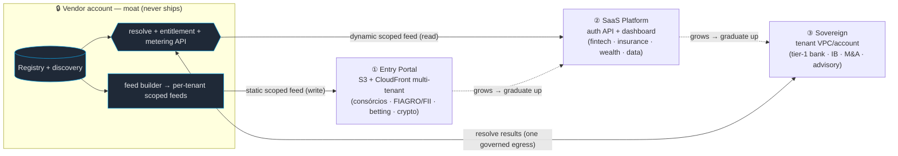

# ADR 016 — Distribution tiers: Entry Portal · SaaS Platform · Sovereign (delivery × vertical)

- Status: **Proposed** (2026-08-30).
- **Revises** [ADR 015 — Portal & Marketplace](2026-08-29-adr-distribution-portal-marketplace.md).
  ADR 015's **telemetry axis and moat invariant stand**; this ADR adds a second,
  orthogonal **delivery-mechanism / sovereignty axis** and keys the default tier to the
  **vertical**. ADR 015's *Portal* splits into **Entry Portal** (static) + **SaaS
  Platform** (dynamic); its *Marketplace* becomes **Sovereign**.
- **Builds on** [ADR 002](2026-08-18-adr-commercial-multitenancy.md) (packaging,
  entitlement, IP/moat, price-by-concentration) and [ADR 001](2026-08-17-adr-entities-registry.md)
  (registry, resolve-not-enumerate). ADR 002 remains the principles substrate.

## Why revise

ADR 015 was right that **telemetry is a defining axis**, but as **data and tenant count
grow** one shared "Portal" is too coarse. Two things vary by *vertical*, and they track
ADR 002's "price by concentration × regulation":

- **Delivery mechanism** — a fragmented, high-tenant-count, low-ARPU vertical (consórcios,
  FIAGRO/FIIs) wants a **cheap static feed at scale**; an interactive mid vertical (fintech,
  insurance) wants a **dynamic API + dashboard**; a concentrated, highly-regulated buyer
  (tier-1 banking, M&A) wants the stack **inside its own perimeter**.
- **Sovereignty** — how close to the customer's control plane the compute runs.

So we productize **three delivery tiers**, each a point on ADR 015's telemetry axis, with a
**default vertical mapping** and an **upward migration ladder** (a tenant graduates as it
grows). The moat invariant is untouched.

## The moat invariant (unchanged, ADR 002 Decision 4/8)

Ingest broadly once (shared sensor) → persist finds once (the registry, the moat) → the
**registry never ships**. Only derived, IP-stripped, entitlement-scoped output crosses out;
for Sovereign, only **name→entity resolution results** cross *inward* over one governed
egress (see §Sovereign).

## The three tiers

| | **Entry Portal** | **SaaS Platform** | **Sovereign** |
|---|---|---|---|
| **Delivery** | Static S3 feeds via **CloudFront multi-tenant** | Authenticated **dynamic API** + dashboard | Stack in the tenant's **own VPC / account** |
| **= ADR 015** | Portal (static half, Pattern B) | Portal (dynamic half, Pattern A) | Marketplace (extended) |
| **Telemetry** | On — *read patterns only* (static ⇒ no in-glass) | On — *richest* (vendor-hosted glass) | **Off** |
| **Entitlement enforced** | at **write** (per-tenant scoped static feed) | at **read** (server-authoritative feed Lambda) | at **resolve** (the central API meters it) |
| **Hosting** | Vendor | Vendor | Tenant VPC/account |
| **Billing** | Low / self-serve / metered | Module subscription (direct) | AWS Marketplace + Private Offers; compute on the tenant's bill |
| **Default verticals** | Consórcios · FIAGRO/FIIs · Betting/Gaming · Crypto | Fintech/Adquirência · Insurance (SUSEP) · Wealth/Asset Mgmt · Data/Analytics | Tier-1 Banking · Investment Banking · M&A/Private Markets · Advisory |

Telemetry is still **on (Entry + SaaS) vs off (Sovereign)** — Entry isn't a *sold*
reduced-telemetry tier (the middle ADR 015 retired); it simply *captures less by mechanism*
because a static feed has no vendor-hosted glass to instrument. Both Entry and SaaS are
shared-vendor-infra, telemetry-on, consented.

## ① Entry Portal — static feeds at scale (CloudFront multi-tenant)

For fragmented, high-count, low-ARPU verticals where per-tenant cost must approach zero.

- **Mechanism**: one CloudFront **multi-tenant distribution template** → many **tenant
  distributions** (per-tenant custom domain + config), each serving that tenant's
  **entitlement-scoped static feed** from S3. Entitlement is enforced **at write**: the feed
  builder emits `feed/<tenant-or-module>.json` (module shards shared across tenants of a
  module, cacheable), and the tenant only ever has a signed/scoped path to what it licensed —
  the superset never lands. (ADR 015 Pattern B, taken to a pure-static extreme.)
- **Telemetry**: server/edge **read patterns** only (CloudFront access logs) — no in-glass
  beacon. Enough for anti-scrape (breadth/volume anomaly) + basic usage.
- **Cost**: near-zero idle floor, CDN-cached, no per-request Lambda; scales to thousands of
  tenants. *Verify current CloudFront SaaS/multi-tenant distribution limits (per-account
  distribution/tenant caps, custom-domain/cert handling) before committing — feature specifics
  post-date this doc's knowledge cutoff.*

**Derived projection, not a parallel pipeline — "don't fork the pipeline; fork the feed."**
The Entry Portal is a *filtered slice of the one full feed*, never a second sensor. The
**single** pipeline (ingest → synth → detectors → feed builder) runs once over **all** entities
— that is the moat and the full-coverage source of truth, kept **unchanged**. The feed builder
then emits one additional **entry-scoped feed**: filter to the entry-vertical industry modules
(`consórcio`, `agri-funds`/`real-estate-funds`, `betting`, `crypto`) using the `industries[]`
each card already carries, and write it as the static shards CloudFront multi-tenant serves.
Three consequences fall out for free: **(a)** the original keeps tracking every entity across
every industry, untouched; **(b)** the entry feed can never contain *more* than the original —
it is a strict filtered slice, so no un-entitled module leaks and there is no drift to keep in
sync; **(c)** zero extra ingest/synth cost — just one more scoped write. The Entry **dashboard**
is derived the same way: a **thin static glass** reading the scoped feed (no API, no
per-request Lambda), reusing the frontend components with the dynamic bits (agent Q&A, live
filters) stripped — those stay on SaaS. A second parallel ingest+synth pipeline is explicitly
rejected: it would fork the moat, duplicate Bedrock/ingest cost, and drift from the original.

## ② SaaS Platform — dynamic API + dashboard

The default for interactive mid verticals (the richest product surface).

- **Mechanism**: authenticated `GET /api/feed` (Pattern A feed Lambda) + the vendor-hosted
  warroom dashboard + agent Q&A. Entitlement enforced **at read**, server-authoritative
  (`requested ∈ tenant.modules`); derived aggregates (KPIs, autocomplete, timelines) scoped
  too. Migrate hot modules to signed static shards for CDN economics as needed.
- **Telemetry**: richest — vendor hosts the instrumented glass (every view/drill-down/session,
  consented; the same instrument as anti-exfiltration).
- **Billing**: module subscription, direct.

## ③ Sovereign — stack in the tenant's perimeter

The premium for concentrated, compliance-bound buyers (ex-ADR 015 Marketplace + ADR 005
Private tenant): the full pipeline runs in the **tenant's own VPC/account** (CDK/CFN), with
**tenant private-data fusion** (their S3 corpus → their KB, private citations never leave),
telemetry **off** (non-observation is the product).

- **Entity resolution — keep the live resolve API (decided).** The in-account synth calls the
  central `POST /resolve` (resolve-by-known-id, projected, rate-limited, no list/scan/batch)
  over **one governed, audited egress**. The registry/discovery **stay central** and never
  ship; only per-encounter resolution results cross in. That endpoint is the metering +
  entitlement + revoke chokepoint.
- **Honesty on "air-gapped":** with a live resolve API, Sovereign is a **sovereign private-VPC
  with a single audited egress**, *not* a zero-egress air-gap. That is the deliberate trade:
  it keeps the moat central (no registry replica) at the cost of one outbound dependency. A
  **true zero-egress** variant (a bounded, entitlement-scoped resolution *snapshot* synced in
  on a cadence) is **deferred** — it trades staler discovery and a larger moat-exposure surface
  for full air-gap, and no buyer has yet required it. Revisit if one does.

## Migration ladder (default by vertical, graduate up)

The `tier` is a **default the vertical lands in**, not a cage: a tenant **graduates up** as
its data footprint, tenant count, or compliance needs grow (Entry → SaaS → Sovereign; a
tier-1 bank starts at Sovereign). Migration re-provisions **delivery only** — the
**entitlement source of truth is unchanged** (`onca-tenant-config` gains a `tier` field
alongside `modules[]`), and the moat/registry boundary is identical in every tier. So
"migrating tiers" is a delivery-plane change, never a re-model. Downward migration is possible
but not a product goal.

## Consequences

**Positive**
- Each vertical gets a delivery mechanism matched to its economics (static-cheap /
  dynamic-rich / sovereign-private) without forking the product core or the moat.
- Entry Portal makes thousands of low-ARPU tenants viable (near-zero per-tenant cost).
- One entitlement record + one registry boundary across all three tiers; migration is a
  delivery re-provision, not a rebuild.

**Costs / risks (honest)**
- Three delivery planes to build/operate (static-shard emitter + multi-tenant CloudFront;
  the dynamic API/dashboard; the in-account CDK stack) vs ADR 015's two.
- CloudFront multi-tenant has account/feature limits to validate; custom-domain/cert
  management per tenant is real operational surface.
- Sovereign's single egress is a hard runtime dependency (the resolve API) — cap/rate/canary
  it; a true air-gap remains unsolved by design (snapshot variant deferred).
- Entry's write-time scoping must reach every emitted shard — a leak here is the whole
  superset for that module.

## Open decisions (owner: commercial + platform)
- **Vertical map is a default** — confirm the per-vertical tier assignments (esp. Data/Analytics
  and Insurance sit near the Entry/SaaS line) and the graduation triggers (what data/tenant
  thresholds prompt an up-migration).
- **Entry billing shape** — flat self-serve vs metered-per-feed; and whether Entry gets the
  agent Q&A at all (it's a dynamic surface — may be SaaS-only).
- **True air-gap** — build the scoped-snapshot resolver only when a Sovereign buyer mandates
  zero egress.

## Build deltas (against ADR 015)
- **Entry**: a CloudFront multi-tenant distribution template + per-tenant provisioning;
  extend the feed builder to emit a **derived, entry-scoped feed** (filter the single full feed
  by entry-vertical industry modules) as per-tenant/module **scoped static shards** at write
  time — **not** a parallel pipeline; + a **thin static Entry dashboard** reading the scoped
  feed (frontend components reused, dynamic surfaces stripped).
- **SaaS**: already the ADR 015 Portal dynamic path (Pattern A feed Lambda + dashboard + agent).
- **Sovereign**: ADR 015 Marketplace / ADR 005 deltas unchanged (tenant-deployable CDK stack,
  `tenant_s3` lens, `/resolve` hardening, metering).
- **Cross-cutting**: add `tier ∈ {entry, saas, sovereign}` to `onca-tenant-config`; the tier
  selects the delivery plane, never the entitlement/moat rules.
