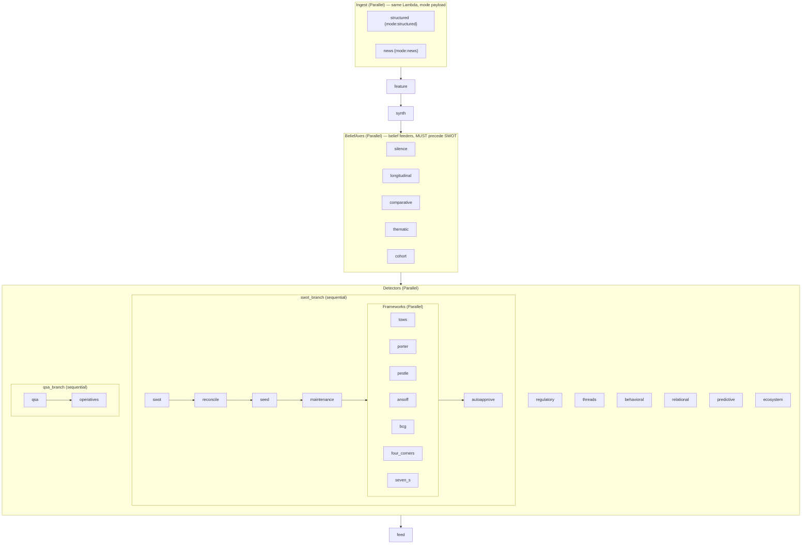

# OncaPipeline — topology, contracts & constraints (living doc)

- **Owner:** the `pipeline-engineer` subagent. This is the source-of-truth map for the
  orchestration layer; keep it reconciled with `infra/app.py` on every structural change.
- Seeded 2026-08-30 from `infra/app.py`. State machine `OncaPipeline` (live ARN in the
  `onca-live-resources-deploy` memory), account `my2027` / us-east-1.
- Shape: two-phase parallelized DAG (issue #10). Tasks pass **empty payloads** and
  coordinate **only through S3 + DynamoDB** — the ordering constraints below are *data*
  dependencies, not control flow.

## DAG

Chain: `Ingest → feature → synth → BeliefAxes → Detectors → feed`. Critical path ≈ the
`swot → reconcile → seed → maintenance → Frameworks → autoapprove` branch (not the sum
of ~24 steps). State-machine timeout **45 min**.

### Ingest retry policy — FAIL FAST on a sandbox timeout (2026-09-13)
Both ingest branches carry, in order: CDK's default transient-Lambda retrier, then
`{"ErrorEquals":["Sandbox.Timedout","States.Timeout","Lambda.Unknown"],"MaxAttempts":0}`,
then `States.ALL` (2 attempts / 30s / x2). First match wins, so a **900s Lambda timeout
never retries**. Before this, a stalled ingest burned 2 full 900s attempts plus a third
in flight and the run died as `ExecutionTimedOut` at the 45-min ceiling — the failure was
absorbed for 45 min instead of surfacing. It now fails clean at ~15 min and raises the
pipeline-failure alarm/SNS. The 45-min state-machine timeout is a backstop, **not** the
thing that surfaces a stalled ingest.

## Ordering invariants (breaking these silently corrupts the run)
1. **Ingest before feature/synth.** `structured` writes the base digest
   `lambda-digests/<id>.json` (+ owns the raw corpus); `news` writes
   `lambda-digests/news/<id>.json`; synth (`digest_io.load_latest_digest_from_s3`)
   overlays the latest news slice onto the latest base.
2. **BeliefAxes before SWOT.** SwotTask builds beliefs from *this run's* axis narratives
   carrying a `swot_hint` (comparative/cohort/thematic) or deriving S/W
   (longitudinal/silence) — so all five belief feeders must finish before the SWOT branch
   or the hints only land next run (via the 90-day window).
3. **SWOT store is sequential:** build → reconcile → seed → maintenance. Frameworks are
   **parametric over the SWOT store** (read it), then autoapprove folds their proposals in.
4. **feed runs LAST** — `feed_builder` reads `narratives/{date}/…` + registry rollups. A
   step whose output must reach the dashboard has to run **before** `feed`.
5. The Detectors NOT feeding/read-by SWOT (regulatory, threads, behavioral, relational,
   qsa→operatives, predictive, ecosystem) run concurrently with the SWOT+frameworks branch.

## S3 / state contracts
- **Digests bucket** `onca-digests-668449743071`: `bcb_ifdata/index.json` (market-share
  store **+ the quarterly resolve cursor** — ingest reads it at the top of the IF.data block
  and writes it back; feed_builder reads `share_by_entity`/`system_size` from it),
  `lambda-digests/<id>.json` (base),
  `lambda-digests/news/<id>.json` (news slice), `narratives/{date}/cand-*.json`,
  `features/latest.json`, `coverage_gaps/index.json`, `distress/index.json`,
  swot/framework stores.
- **Site bucket** (…`oncadashboardsite`…): `feed.json` (written by feed-builder).
- **DynamoDB**: registry `…OncaEntitiesTable…` (ENT#/ALIAS#/CNPJ#), state/seen-set
  `…OncaStateTable…` (sharded `__seen__#N`; **Decimal, never float**).

## Per-Lambda config (memory / timeout) — pipeline tasks
| Task (SM) | Lambda | mem MB | timeout |
|---|---|---|---|
| Ingest (structured ∥ news) | OncaLambdaPrototype (`ingest.lambda_port`) | 1024 | 15 min |

Measured 2026-09-13 (live, same Lambda, `mode` payload): **news ~127s**, **structured 577s**
during the IF.data quarterly catch-up (IF.data window = 118s of it), expected ~460s once the
quarter is walked. Before the fix, structured hit the 900s ceiling on ~60% of runs
(09-08 → 09-12), which is what produced the `TIMED_OUT` executions.
| synth | OncaSynthesisLambda | **1536** | 5 min |
| feature | OncaFeatureStore | 512 | 5 min |
| silence / longitudinal / comparative / thematic / cohort | Onca{…} | 512 | 5 min |
| regulatory / threads / behavioral / relational / operatives / predictive / ecosystem | Onca{…} | 512 | 5 min |
| swot / swot_reconcile / swot_seed | Onca{…} | 512 | 5 min |
| swot_maintenance | OncaSwotMaintenance | 256 | 2 min |
| tows/porter/pestle/ansoff/bcg/four_corners/seven_s | Onca{…} | 256 | 3 min |
| autoapprove | OncaAutoApprove | 256 | 2 min |
| watchlist_qsa | OncaWatchlistQsa (`ingest.watchlist_qsa`) | 256 | 5 min |
| feed | OncaFeedBuilder | 512 | 5 min |

**Off-chain Lambdas** (API/UI, not in the state machine): OncaRunTrigger (starts the SM),
OncaAgent (`/api/ask/`, 512/60s), OncaGapsApi (512/90s), OncaRegistryApi, OncaReviewAction
(256/30s). Changes to these don't affect DAG timing.

## Constraints to keep
- **Lambda CPU scales with memory** (512MB ≈ 0.36 vCPU). CPU-bound steps (synth: candidate
  extraction / resolve_entities over the growing registry) need memory headroom — synth is
  at 1536MB for this reason. Right-size here, not by raising timeouts.
- **Per-source budget** `ONCA_SOURCE_TIMEOUT_SEC=180` (SIGALRM) bounds each ingest source so
  a slow endpoint can't eat the 15-min ingest; a source hitting it is skipped, not fatal.
  The overall stop-starting-new-work deadline is `remaining − ONCA_INGEST_RESERVE_SEC(45)`.
  **The budget re-arms** (`ONCA_SOURCE_BUDGET_REARM_SEC=5`): SIGALRM is one-shot, and the
  kill exception was being swallowed by best-effort `except Exception` loops inside sources
  (and re-wrapped by botocore as a retryable `HTTPClientError`), after which the source ran
  completely unbounded to the 900s ceiling. A source with such a loop must also re-raise
  `src.ingest.budget.SourceBudgetExceeded` explicitly (see `bcb_ifdata.map_to_entities`).
- **Quarterly/monthly sources must not redo their work 3x/day.** IF.data is the worked
  example (`bcb_ifdata` + the `IF.data market` block in `lambda_port`): it downloaded a
  58MB/153k-row report **twice** (`latest_base_date()` probed with FULL fetches) and ran
  ~1,422 `resolve_entities` calls at ~200-600ms each — ~320-840s, i.e. the whole ingest
  budget in the FIRST source, producing a byte-identical store on ~270 runs/quarter. Now:
  `$top=1` date probe, an incremental resolve window (`ONCA_IFDATA_MAX_RESOLVE=150`/run)
  with the cursor persisted in `bcb_ifdata/index.json` (`base_date`/`cursor`/`universe`/
  `top`), and a full no-op once the quarter is walked. Apply the same pattern before adding
  any other slow, low-cadence source.
- **Bedrock** model quotas/throttling (synth + framework drafters call Converse); healthy
  ≈ 1–3 s/call. Watch for throttle storms when many framework branches fire concurrently.
- **Cost ceiling ~$100/mo, no idle floor** (S3 Vectors KB, not OpenSearch). New always-on
  resources or big memory bumps must respect it.
- **Tuning knobs** (env, in `infra/app.py`): `ONCA_SYNTH_MAX_CANDIDATES`, `ONCA_SYNTH_MIN_*`,
  `ONCA_SOURCE_TIMEOUT_SEC`, `ONCA_*_MAX_ENTITIES`, `ONCA_RESOLVE_PREFILTER`,
  `ONCA_ENTITY_DISCOVERY*`, `ONCA_FIAGRO_*`. A CLI-set env/memory is wiped by the next
  `cdk deploy` — make durable changes here.

## Deploy (DIRECT — not the onca-cicd pipeline)
- DAG/infra/Lambda-config changes: `cd infra && cdk deploy OncaPrototypeStack`.
- Code-only: fast-zip `aws lambda update-function-code` per changed function (rsync
  `src/`→`build/lambda` first). See the `onca-live-resources-deploy` memory.
- Trigger a run: `aws stepfunctions start-execution --state-machine-arn <arn> --input '{}'`
  (`AWS_PROFILE=my2027`); watch `describe-execution` / `get-execution-history`.
